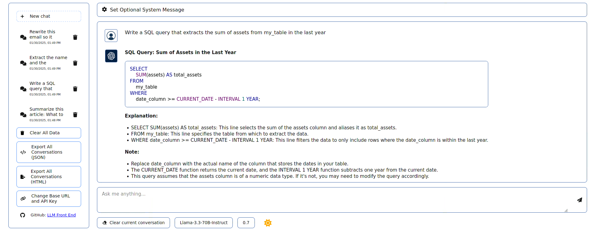
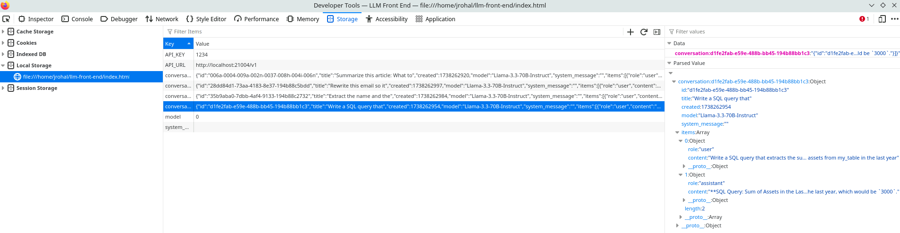

# Front End for Large Language Models

A front end for using large language models (LLMs) that offer an [OpenAI compatible API](https://platform.openai.com/docs/api-reference/introduction). 

This is a heavily modified version of code from [@alexsky177 on GitHub](https://github.com/alexsky177/chat), so the license must stay as [GPL-3.0](https://www.gnu.org/licenses/gpl-3.0.en.html). A number of bug fixes and changes were introduced including the ability to:
* Export all conversations
* Clear all conversations
* Set the system message
* Change the base API URL and API key
* Change your model

This is a client side application, so to access it you can either clone the repo and open `index.html` in a browser or access the [GitHub pages site](https://jjrohal.github.io/llm-front-end/) directly. Begin by clicking the  button to change the base URL for your LLM API endpoint along with the API key. Provided that your API has a `/models` endpoint, the application will identify any models available for use. For example, to use the OpenAI API you would set the base to https://api.openai.com/v1. Using a locally deployed LLM via something like [vLLM](https://github.com/vllm-project/vllm) you might have a base URL of the form [http://localhost:PORT](http://localhost:PORT) instead.

All conversations are stored in [localStorage](https://developer.mozilla.org/en-US/docs/Web/API/Window/localStorage). Please be aware of the [security implications](https://dev.to/rdegges/please-stop-using-local-storage-1i04) of that choice. You can view the contents of localStorage by going to Developer Tools and looking at Application > Storage > Local Storage > /path/or/url/to/llm-front-end/index.html.

